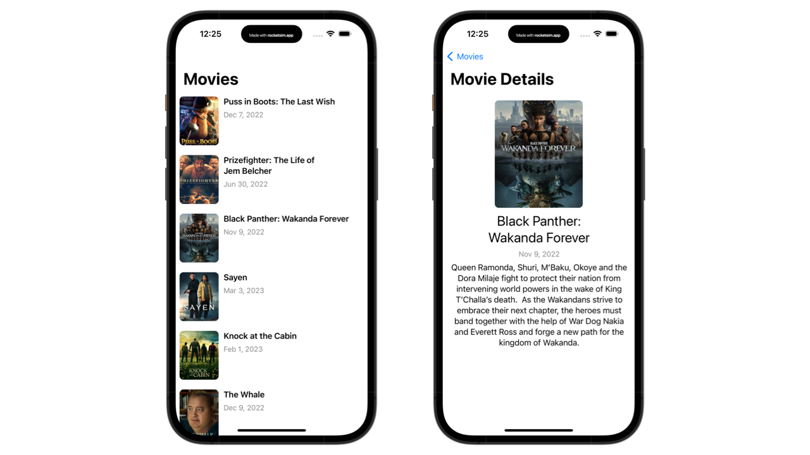

# TheMovieDB

## Description:
This iOS app lets you browse movies from the MovieDB API and view their details 
Developer: **[Ibrahima CISS](https://github.com/Bionik6)**

## Usage:
* Download the project
* Open it in Xcode
* Create a *`Secrets.xcconfig`* file and place it in the root directory (TheMovieDB/Secrets.xcconfig)
* Open the config file and add a variable named `API_KEY` to store the token of the API (*`API_KEY = iOiJQUzI1NiIsInppcCI6IkdaSV...`*)
* Press `Command + U` to run all the tests suite
* Build and run the project in the simulator

## Architecture:
This project uses the MVVM+C architecture. The flow goes like this:
View (send actions) <-> ViewModel <-> UseCase <-> Repository <-> Data Source.
Coordinators are used to decouple navigation from the ViewController.
Furthermore, the app's core functionalities are split into feature and core modules, allowing us to build and test a feature in pure isolation.  
Each feature module respects this architecture where the ViewController sends actions to the ViewModel, which asks the UseCase to execute the action. The UseCase asks the repository to fetch data from the remote data source and then sends it back to the ViewModel, which triggers a state change via its publishers.  
Dependency Injection is heavily used to allow a loosely-coupled codebase.  

## Improvements:
* Write snapshot and end-to-end tests for the presentation layer (ViewControllers) since the domain and data layers are well covered by unit tests.
